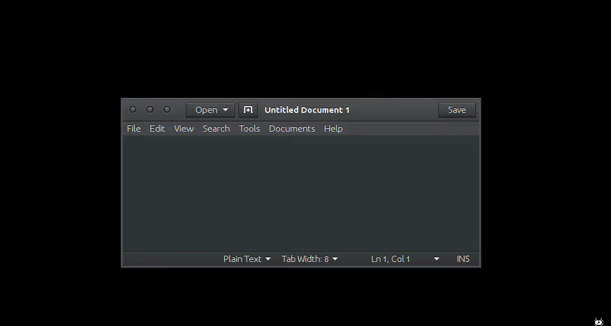

kbsecret-dmenu-pass
===================

`kbsecret dmenu-pass` uses [dmenu](http://tools.suckless.org/dmenu/) to list all login records
in the default session, then copies the password from the selected record into the user's
clipboard.

## Usage

```bash
$ kbsecret dmenu-pass
```

## Demo


