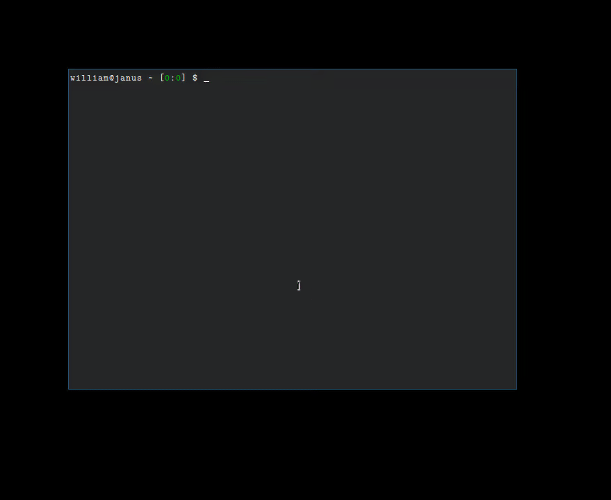

kbsecret-qr
===========

`kbsecret qr` generates a QR code containing the password for a given login record, then
displays it. Uses `qrencode` for QR generation and `feh` for display.

No copies of the QR are saved on disk.

## Usage

```bash
$ kbsecret qr [--session <session>] <record>
```

## Demo


