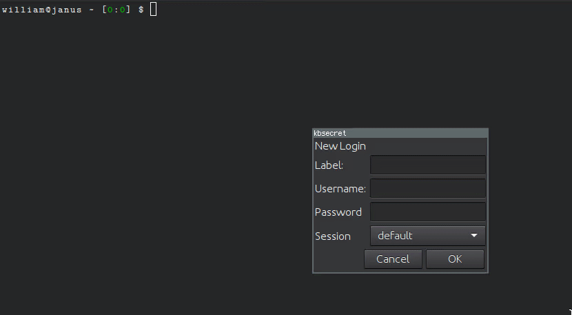

kbsecret-yad-login
=================

`kbsecret yad-login` adds a login record to a session via a
[YAD](https://code.google.com/archive/p/yad/)-generated GUI.

## Usage

```bash
$ kbsecret yad-login
```

## Demo


